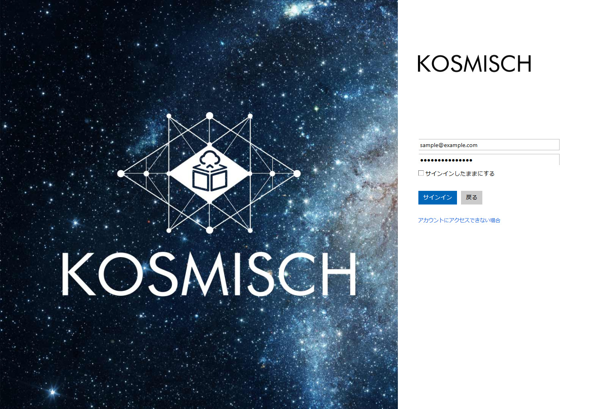
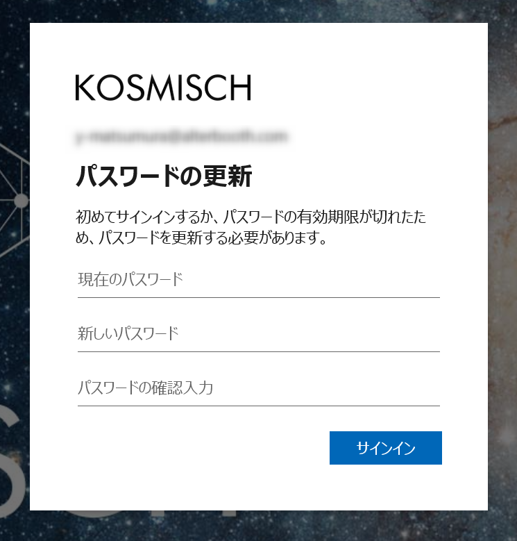
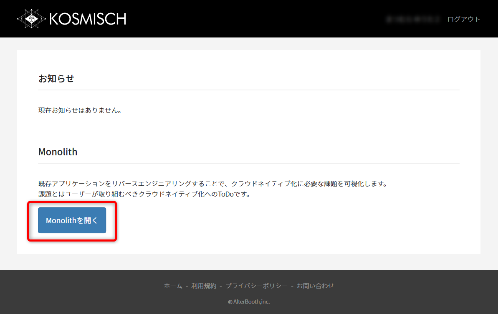
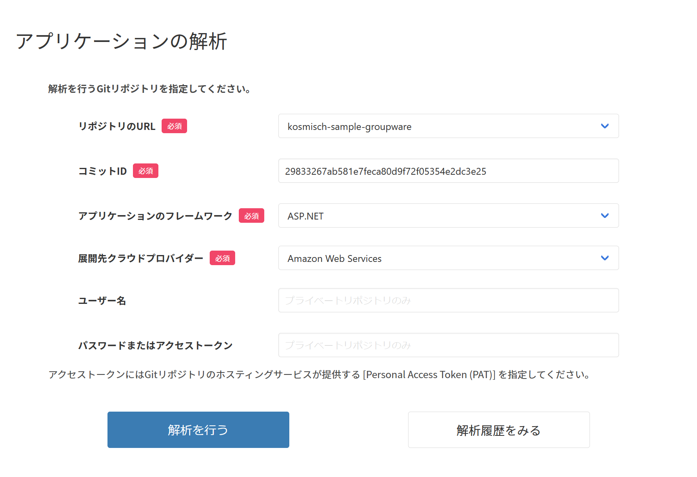
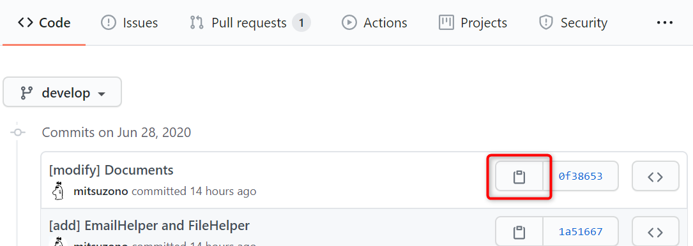
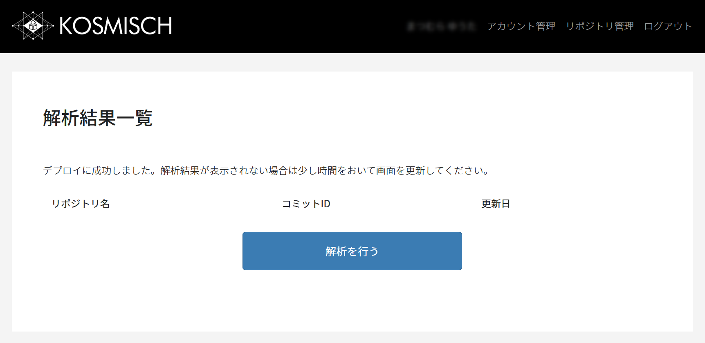

# KOSMISCH Monolithを使ってアプリケーションを解析する
ステートフルであるASP.NETアプリケーションをKOSMISCH Monolithで解析し、クラウド上で実行させるうえでの問題点を確認しましょう。  

## 1.KOSMISCHのアカウントを作成する
[https://console.kosmisch.tech/account/register](https://console.kosmisch.tech/account/register) にアクセスし、ページ上部の「KOSMISCHアカウント作成」をクリックします。  
アカウント作成フォームに必要な情報を入力し、作成をクリックします。  
これでアカウントの作成は完了です。

---

## 2.KOSMISCHにログインする
登録したメールアドレスに仮パスワードが送信されるため、メールの内容に沿ってログインしましょう。  
初回ログイン時にパスワードの変更を求められますので、自身のパスワードに変更してください。  
  

---

## 3.解析を行うGitリポジトリを登録する
アプリケーションを解析するための準備を行いましょう。

1. KOSMISCHのダッシュボードにログインできたら、ページ中央からMonolithにアクセスする  

1. 画面右上のメニューのリポジトリ管理をクリックする
1. 下記を入力して登録をクリックする
    - 名前：リポジトリを識別しやすい文字列
    - URL：フォークしたGitHubのリポジトリURL（※）

※GitHubのリポジトリページの「Clone or download」をクリックし、`https`から始まるURLをコピーしてください。  

---

## 4.KOSMISCH Monolithでアプリケーションを解析する
これから実際にKOSMISCH Monolithを使用し、既存のASP.NETアプリケーションの解析を行います。

1. [https://monolith.kosmisch.tech](https://monolith.kosmisch.tech) にアクセスする

1. 下記を入力して解析を開始する
    - リポジトリのURL：先程登録したリポジトリ
    - コミットID：今回は最新のコミットIDを指定する（※）
    - ユーザー名：入力しない
    - パスワードまたはアクセストークン：入力しない
    - アプリケーションフレームワーク：ASP.NET
    - 展開先クラウドプロバイダー：Amazon Web Services

※GitHubのリポジトリページに記載されています。  

---

## 5.アプリケーションの解析結果を見る
アプリケーションの解析を開始すると、KOSMISCH MonolithがGitリポジトリに含まれるソースコードに対して、PaaS環境にどの程度適している状態であるかを解析します。  
解析結果は数分で生成されリストアップされます。もし表示されない場合は画面を更新してください。  

---

### 6.レポートの読み方
後述する解析項目について、「○」「✕」「△」の判定を行います。  
- ○：現状の実装から変更を行う必要が**ない**可能性が高い  
- ✕：現状の実装から変更を行う必要が**ある**可能性が高い  
- △：どちらでもない(クラウド移行後の影響を受けない可能性が高い)

また各項目について解析対象のファイル情報や行番号を表示し、推奨される対応内容も併せて表示されます。

---

### 6-1.ステートフル／ステートレスの解析
以下の観点において、PaaS環境で実行する際に考慮すべき**ステートフル構成**の実装であると推測される箇所を列挙します。

- サーバー設定ファイル (ASP.NETでは `Web.config` ファイル)
- データベースへの接続情報
- メールサーバーへの接続情報
- セッションを使用している箇所
- アプリケーション外にHTTP通信を行っている箇所
- ディレクトリ操作を行っている箇所
- ファイル操作を行っている箇所
- 日付情報を扱っている箇所

---

### 6-2.マイグレーションの解析
以下の観点において、ASP.NETからASP.NET Coreにマイグレーションを行う際に**変更すべき実装の必要がある**と推測される箇所を列挙します。

- プロジェクトファイルの構成 (ASP.NETでは `.csproj` ファイル)
- 使用しているライブラリの対応状況 (ASP.NETではNuGet)
- スタートアップファイルの構成 (ASP.NETでは `Global.asax` ファイルや `Global.asax.cs` ファイル)
    - ルーティングの定義
    - エリアの定義
    - フィルターの定義
    - バンドルの構成
    - データベースの接続定義

---

## 今回のサンプルの場合

- データベース設定
- メールサーバー接続情報
- DbContext型使用箇所
