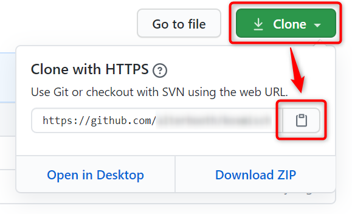
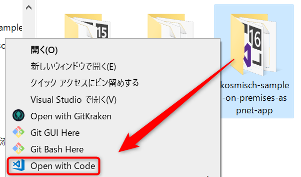
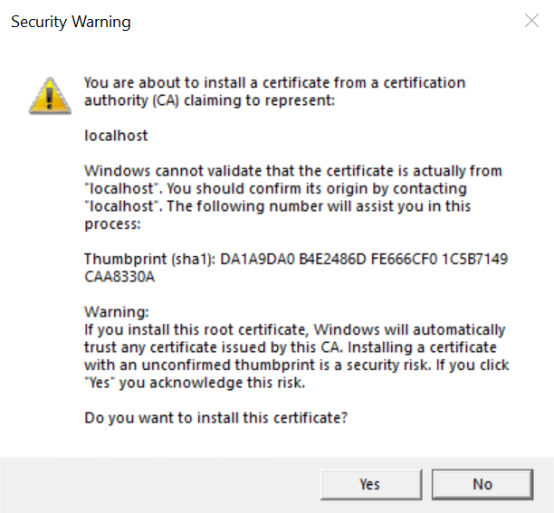
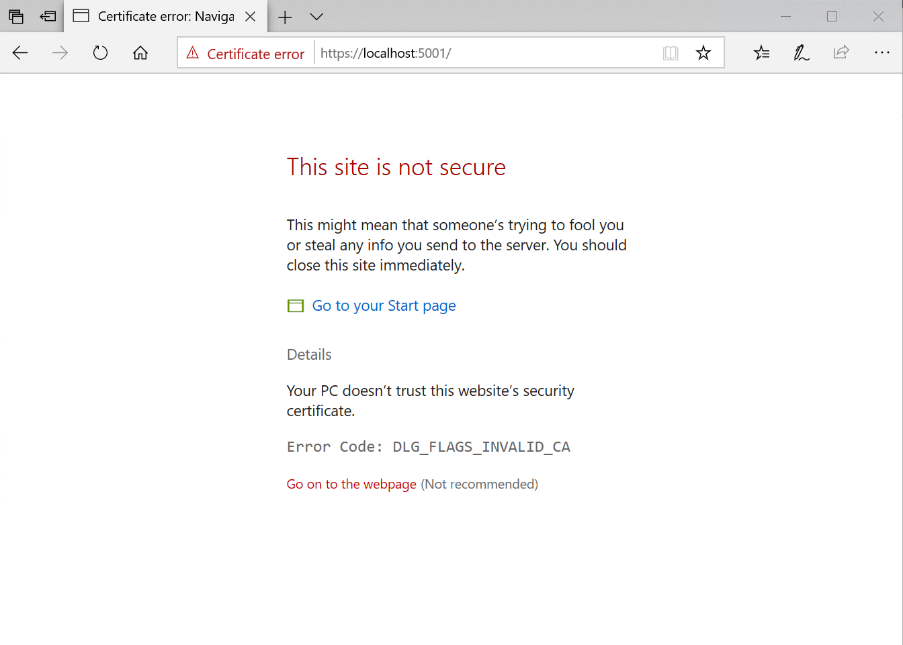
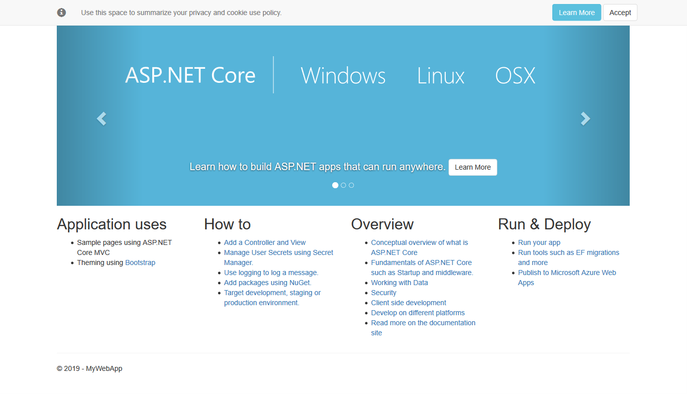
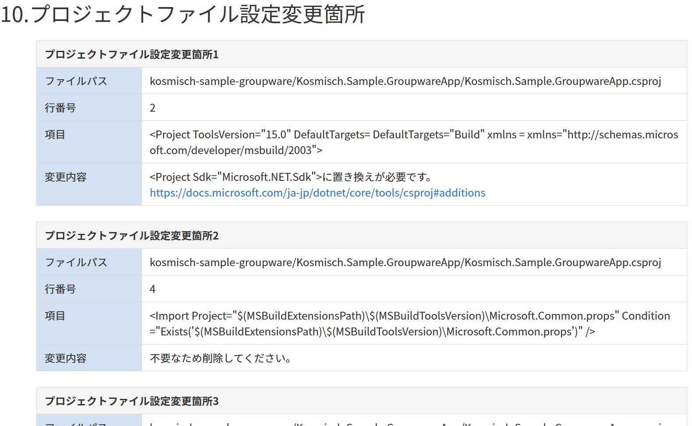
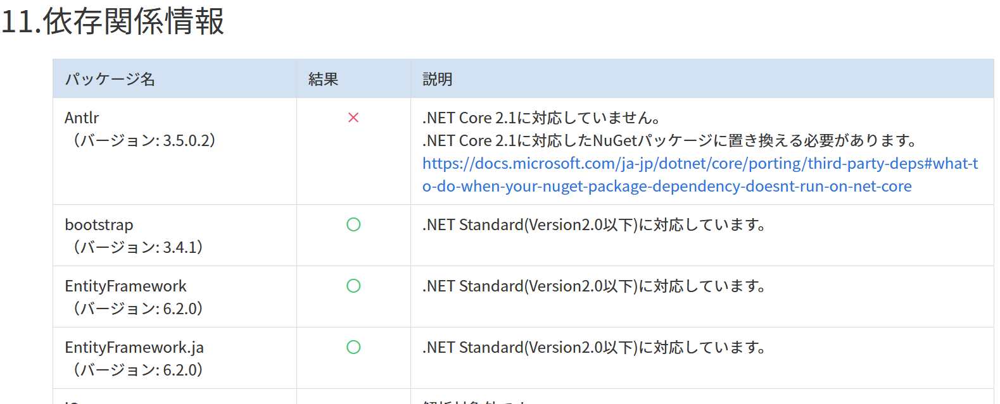
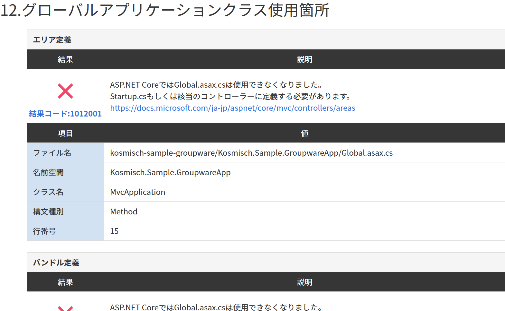

# ASP.NET アプリケーションを ASP.NET Core アプリケーションに移行する
KOSMISCH Monolithを使用して、既存のASP.NETアプリケーションの問題点を整理しました。  
続いては実際に **ASP.NET** から **ASP.NET Core** に移行する作業を行いましょう。

## ASP.NET Coreとは
.NETを使用して、最新のクラウドベースのWebアプリケーションを構築するための、新しいオープンソースおよびクロスプラットフォームフレームワークです。  
[ASP.NET Core の概要 | Microsoft Docs](https://docs.microsoft.com/ja-jp/aspnet/core/)

ASP.NET Coreで実装可能なアプリケーションは以下のとおりです。  
- Webアプリケーション(MVC, Razor Pages)
- Web API
- リモートプロシージャコール(gRPC)
- リアルタイムWeb(SignalR)
- Progressive Web Apps(Blazor)

---

## 1.準備
1. 自身のGitHubアカウントにフォークしたリポジトリのページを開く

2. リポジトリをクローンするためのURLをコピーする  


3. コマンドを入力してリポジトリをクローンする  
`git clone (コピーしたURL)`

4. `Kosmisch.Sample.GroupwareApp`ディレクトリを`Kosmisch.Sample.GroupWareApp.Net47`にリネームする

5. `Kosmisch.Sample.GroupwareaApp.sln`ファイルを削除する

6. `packages`ディレクトリがあれば削除する

7. リポジトリのディレクトリをVisual Studio Codeで開く  


---

## 2.プロジェクトを作成する
リポジトリのディレクトリにて下記のコマンドを実行します。  
この手順により ASP.NET Coreのソリューションファイルおよびプロジェクトを作成することができます。

```
dotnet new global.json --sdk-version 2.1.508
dotnet new mvc -o Kosmisch.Sample.GroupwareApp
dotnet new sln -n Kosmisch.Sample.GroupwareApp
dotnet sln Kosmisch.Sample.GroupwareApp.sln add Kosmisch.Sample.GroupwareApp/Kosmisch.Sample.GroupwareApp.csproj
dotnet dev-certs https --trust
```

実行結果はこのようになります。

```
> dotnet new global.json --sdk-version 2.1.508
The template "global.json file" was created successfully.

>  dotnet new mvc -o Kosmisch.Sample.GroupwareApp
テンプレート "ASP.NET Core Web App (Model-View-Controller)" が正常に作成されました。
このテンプレートには Microsoft 以外からのテクノロジが含まれています。詳細については https://aka.ms/aspnetcore-template-3pn-210 をご覧ください。

作成後のアクションを処理しています...
  ***\kosmisch-sample-groupware\Kosmisch.Sample.GroupwareApp\Kosmisch.Sample.GroupwareApp.csproj の復元が 2.64 sec で完了しました。

正常に復元されました。

> dotnet new sln -n Kosmisch.Sample.GroupwareApp
テンプレート "Solution File" が正常に作成されました。

> dotnet sln Kosmisch.Sample.GroupwareApp.sln add Kosmisch.Sample.GroupwareApp/Kosmisch.Sample.GroupwareApp.csproj
プロジェクト `Kosmisch.Sample.GroupwareApp\Kosmisch.Sample.GroupwareApp.csproj` をソリューションに追加しました。

> dotnet dev-certs https --trust
Trusting the HTTPS development certificate was requested. A confirmation prompt will be displayed if the certificate was not previously trusted. Click yes on the prompt to trust the certificate.
A valid HTTPS certificate is already present.
```

`dotnet dev-certs https --trust`を実行した際に、次のようなプロンプトが表示された場合は「はい」または「Yes」をクリックします。  


上記の手順を行うことで、ASP.NET CoreのHTTPS開発証明書をローカル環境にインストールすることができます。  
HTTPS開発証明書をインストールしない場合、プロジェクトを実行してブラウザでアクセスした際に信頼されていないページである旨のエラーが表示されます。  


---

## 3.プロジェクトを実行する
現時点でのプロジェクトを実行するために `dotnet run` コマンドを入力しましょう。

```
cd Kosmisch.Sample.GroupwareApp
dotnet run
```

実行結果はこのようになります。

```
> dotnet run
D:\tmp\kosmisch-sample-groupware\Kosmisch.Sample.GroupwareApp\Properties\launchSettings.json からの起動設定を使用中...
info: Microsoft.AspNetCore.DataProtection.KeyManagement.XmlKeyManager[0]
      User profile is available. Using 'C:\Users\alterbooth\AppData\Local\ASP.NET\DataProtection-Keys' as key repository and Windows DPAPI to encrypt keys at rest.
Hosting environment: Development
Content root path: D:\tmp\kosmisch-sample-on-premises-aspnet-app\Kosmisch.Sample.OnPremisesAspnetApp
Now listening on: https://localhost:5001
Now listening on: http://localhost:5000
Application started. Press Ctrl+C to shut down.
```

ブラウザを起動して `http://localhost:5000` にアクセスすると、初期テンプレートのWebページが表示されることが確認できます。  
(実行を停止するときは`Ctrl+C`を入力します)



ASP.NETに比べて ASP.NET Coreのプロジェクトファイルは簡素化されました。  
既存のプロジェクトファイルの構成についての移行の必要性の有無は、KOSMISCH Monolithで把握することができます。



現時点の `Kosmisch.Sample.OnPremisesAspnetApp.csproj` の構成は下記のようになります。

```xml
<Project Sdk="Microsoft.NET.Sdk.Web">

  <PropertyGroup>
    <TargetFramework>netcoreapp2.1</TargetFramework>
  </PropertyGroup>

  <ItemGroup>
    <PackageReference Include="Microsoft.AspNetCore.App" />
    <PackageReference Include="Microsoft.AspNetCore.Razor.Design" Version="2.1.2" PrivateAssets="All" />
  </ItemGroup>

</Project>
```

---

## 4.ライブラリを移行する
ASP.NET CoreではASP.NET同様、NuGetに公開されているライブラリを使用することができます。  
ライブラリによっては .NET Frameworkのみをターゲットとしているものもあり、ライブラリのバージョンアップや変更が必要となることがあります。  
ライブラリごとの移行の必要性の有無は、KOSMISCH Monolithで把握することができます。



今回は下記のコマンドでプロジェクトにライブラリをインストールします。

```
dotnet add package Newtonsoft.Json --version 12.0.3
```

実行結果はこのようになります。

```
> dotnet add package Newtonsoft.Json --version 12.0.3
  Writing C:\Users\alterbooth\AppData\Local\Temp\tmpEBDF.tmp
info : パッケージ 'Newtonsoft.Json' の PackageReference をプロジェクト 'D:\tmp\kosmisch-sample-on-premises-aspnet-app\Kosmisch.Sample.OnPremisesAspnetApp\Kosmisch.Sample.OnPremisesAspnetApp.csproj' に追加しています。
log  : D:\tmp\kosmisch-sample-on-premises-aspnet-app\Kosmisch.Sample.OnPremisesAspnetApp\Kosmisch.Sample.OnPremisesAspnetApp.csproj のパッケージを復元しています...
info : パッケージ 'Newtonsoft.Json' は、プロジェクト 'D:\tmp\kosmisch-sample-on-premises-aspnet-app\Kosmisch.Sample.OnPremisesAspnetApp\Kosmisch.Sample.OnPremisesAspnetApp.csproj'  のすべての指定されたフレームワークとの互換性があります。
info : ファイル 'D:\tmp\kosmisch-sample-on-premises-aspnet-app\Kosmisch.Sample.OnPremisesAspnetApp\Kosmisch.Sample.OnPremisesAspnetApp.csproj' に追加されたパッケージ 'Newtonsoft.Json' バージョン '12.0.3' の PackageReference。
info : 復元をコミットしています...
info : ロック ファイルをディスクに書き込んでいます。パス: D:\tmp\kosmisch-sample-on-premises-aspnet-app\Kosmisch.Sample.OnPremisesAspnetApp\obj\project.assets.json
log  : D:\tmp\kosmisch-sample-on-premises-aspnet-app\Kosmisch.Sample.OnPremisesAspnetApp\Kosmisch.Sample.OnPremisesAspnetApp.csproj の復元が 2.36 sec で完了しました。
```

現時点の `Kosmisch.Sample.OnPremisesAspnetApp.csproj` の構成は下記のようになります。

```xml
<Project Sdk="Microsoft.NET.Sdk.Web">

  <PropertyGroup>
    <TargetFramework>netcoreapp2.1</TargetFramework>
  </PropertyGroup>

  <ItemGroup>
    <PackageReference Include="Microsoft.AspNetCore.App" />
    <PackageReference Include="Microsoft.AspNetCore.Razor.Design" Version="2.1.2" PrivateAssets="All" />
    <PackageReference Include="Newtonsoft.Json" Version="12.0.3" />
  </ItemGroup>

</Project>
```

---

## 5.モデルを移行する
Entity Framework Coreの形式に沿ったModelに移行するため、下記のファイルを`Kosmisch.Sample.GroupwareApp/Models`にコピーします。  
- `Kosmisch.Sample.GroupwareApp.Net47/Models/MailViewModel.cs`
- `Kosmisch.Sample.GroupwareApp.Net47/Models/User.cs`

また、`Kosmisch.Sample.GroupwareApp.Net47/Data/UserContext.cs`を`Kosmisch.Sample.GroupwareApp/Data`にコピーします。


---

## 6.データベースの接続定義を移行する
`Kosmisch.Sample.GroupwareApp/appsettings.Development.json`を下記のように変更します。（ここで追記するのは開発環境におけるローカルDBへの接続設定です）

```json
{
  "Logging": {
    "LogLevel": {
      "Default": "Debug",
      "System": "Information",
      "Microsoft": "Information"
    }
  },
  "ConnectionStrings": {
    "DatabaseConnectionString": "Data Source=(localdb)\\MSSQLLocalDB; Initial Catalog=kosmisch-sample-groupware-core; Integrated Security=True; MultipleActiveResultSets=True;"
  }
}
```

---

### 7.DBContextを移行し、DBマイグレーションを行う

### 7-1.UserContextを移行する

`Kosmisch.Sample.GroupwareApp/Data/UserContext.cs`を下記のように変更します。

```csharp
using Microsoft.EntityFrameworkCore;

namespace Kosmisch.Sample.GroupwareApp.Data
{
    public class UserContext : DbContext
    {
        public UserContext(DbContextOptions<UserContext> options) : base(options)
        {
        }

        public DbSet<Kosmisch.Sample.GroupwareApp.Models.User> Users { get; set; }
    }
}
```

---

### 7-2.スタートアップに登録する
ASP.NETのアプリケーションでO/Rマッパーに[Entity Framework](https://docs.microsoft.com/ja-jp/ef/ef6/)を使用している場合、[Entity Framework Core](https://docs.microsoft.com/ja-jp/ef/core/)に移行することが推奨されています。

`Kosmisch.Sample.GroupwareApp/Startup.cs`の冒頭に下記のコードを追加します。

```csharp
using Microsoft.EntityFrameworkCore;
using Kosmisch.Sample.GroupwareApp.Models;
using Kosmisch.Sample.GroupwareApp.Data;
```

`Kosmisch.Sample.OnPremisesAspnetApp/Startup.cs`の`ConfigureServices`メソッドに下記のコードを追加します。

```csharp
services.AddDbContext<UserContext>(options =>
    options.UseSqlServer(Configuration.GetConnectionString("DatabaseConnectionString")));
```

---

## 8.エントリーポイントやスタートアップを移行する
ASP.NETでは`Global.asax`というファイルがエントリーポイントとなり、ルートの定義、フィルターの登録、エリアの登録などを処理していました。  
ASP.NET Coreではエントリーポイントは`Program.cs`というファイルになります。  
また`Startup.cs`というファイルでルートの定義、フィルターの登録、エリアの登録などを処理します。

`Global.asax`から`Startup.cs`に移行する際の問題点については、KOSMISCH Monolithで把握することができます。




### 8-1.フィルターを移行する
`Kosmisch.Sample.GroupwareApp.Net47/Filters`をコピーして`Kosmisch.Sample.GroupwareApp`に貼り付けます。  
`Kosmisch.Sample.GroupwareApp/Filters/LogFilter.cs`を開き、ファイル冒頭のusing群を下記のように変更します。

```csharp
// 変更前
using System.Diagnostics;
using System.Web.Mvc;

// 変更後
using System.Diagnostics;
using Microsoft.AspNetCore.Mvc.Filters;
```

#### 8-2.フィルター読み込みを修正する
`Kosmisch.Sample.GroupwareApp/Startup.cs`の`ConfigureServices`メソッドを下記のように変更します。

```csharp
public void ConfigureServices(IServiceCollection services)
{
    // 変更前のコード
    // services.AddMvc().SetCompatibilityVersion(CompatibilityVersion.Version_2_1);

    // 変更後のコード
    services
        .AddMvc(options => options.Filters.Add(new Kosmisch.Sample.GroupwareApp.Filters.LogFilter()))
        .SetCompatibilityVersion(CompatibilityVersion.Version_2_1);
}
```

### 8-3. Helperを移行する

`Kosmisch.Sample.GroupwareApp.Net47/Helpers`をコピーして`Kosmisch.Sample.GroupwareApp`に貼り付けます。


## 9.コントローラーの移行

次にコントローラーの移行を行います。  
`Kosmisch.Sample.GroupwareApp.Net47/Controllers/`以下の`UsersController.cs`と`MailController.cs`,を`Kosmisch.Sample.GroupwareApp/Controllers`にコピーして、変更を行います。  
主な変更ポイントは以下の通りです。

- usingから`System.Web.Mvc`と`System.Data.Entity`を削除
- usingに`Microsoft.AspNetCore.Mvc`と`Microsoft.EntityFrameworkCore`を追加
- 引数Bindの`Include = `を削除
- `new HttpStatusCodeResult(HttpStatusCode.BadRequest)`を`BadRequest()`に変更
- `HttpNotFound()`を`NotFound()`に変更
- [Autorize]を削除

また、先程のレポートで指摘があった通り、ASP.NET CoreではMyContextをDIで初期化するためコンストラクタ引数で受け取るよう変更する必要があります。  
以上を踏まえ、下記のようにコードを変更します。


`UsersContorller.cs`

```csharp
using System;
using System.Collections.Generic;
using System.Data;
using System.Linq;
using System.Net;
using System.Web;
using Kosmisch.Sample.GroupwareApp.Data;
using Kosmisch.Sample.GroupwareApp.Models;
using Microsoft.AspNetCore.Mvc;
using Microsoft.EntityFrameworkCore;

namespace Kosmisch.Sample.GroupwareApp.Controllers
{
    public class UsersController : Controller
    {
        private UserContext db;

        public UsersController(UserContext db){
            this.db = db;
        }

        // GET: Users
        public ActionResult Index()
        {
            return View(db.Users.ToList());
        }

        // GET: Users/Details/5
        public ActionResult Details(int? id)
        {
            if (id == null)
            {
                return BadRequest();
            }
            User user = db.Users.Find(id);
            if (user == null)
            {
                return NotFound();
            }
            return View(user);
        }

        // GET: Users/Create
        public ActionResult Create()
        {
            return View();
        }

        // POST: Users/Create
        [HttpPost]
        [ValidateAntiForgeryToken]
        public ActionResult Create([Bind("ID,LastName,FirstName,MailAddress")] User user)
        {
            if (ModelState.IsValid)
            {
                db.Users.Add(user);
                db.SaveChanges();
                return RedirectToAction("Index");
            }

            return View(user);
        }

        // GET: Users/Edit/5
        public ActionResult Edit(int? id)
        {
            if (id == null)
            {
                return BadRequest();
            }
            User user = db.Users.Find(id);
            if (user == null)
            {
                return NotFound();
            }
            return View(user);
        }

        // POST: Users/Edit/5
        [HttpPost]
        [ValidateAntiForgeryToken]
        public ActionResult Edit([Bind("ID,LastName,FirstName,MailAddress")] User user)
        {
            if (ModelState.IsValid)
            {
                db.Entry(user).State = EntityState.Modified;
                db.SaveChanges();
                return RedirectToAction("Index");
            }
            return View(user);
        }

        // GET: Users/Delete/5
        public ActionResult Delete(int? id)
        {
            if (id == null)
            {
                return BadRequest();
            }
            User user = db.Users.Find(id);
            if (user == null)
            {
                return NotFound();
            }
            return View(user);
        }

        // POST: Users/Delete/5
        [HttpPost, ActionName("Delete")]
        [ValidateAntiForgeryToken]
        public ActionResult DeleteConfirmed(int id)
        {
            User user = db.Users.Find(id);
            db.Users.Remove(user);
            db.SaveChanges();
            return RedirectToAction("Index");
        }

        protected override void Dispose(bool disposing)
        {
            if (disposing)
            {
                db.Dispose();
            }
            base.Dispose(disposing);
        }
    }
}
```


`MailController.cs`

```
using System;
using System.Collections.Generic;
using System.Data;
using System.Linq;
using System.Net;
using System.Security.Cryptography.X509Certificates;
using System.Web;
using Kosmisch.Sample.GroupwareApp.Data;
using Kosmisch.Sample.GroupwareApp.Models;
using Kosmisch.Sample.OnPremisesAspnetApp.Helpers;
using Microsoft.AspNetCore.Mvc;
using Microsoft.EntityFrameworkCore;
namespace Kosmisch.Sample.GroupwareApp.Controllers
{
    public class MailController : Controller
    {
        private UserContext db;
        
        public MailController(UserContext db){
            this.db = db;
        }

        // GET: Mail
        public ActionResult Index()
        {
            var Model = new MailViewModel();
            Model.Users = db.Users.ToList();
            return View(Model);
        }

        // GET: Mail/Create
        [HttpGet]
                public ActionResult Create([Bind("Ids")] MailViewModel model, string x)
        {
            return View(model);
        }

        // POST: Mail/Create
        [HttpPost]
        [ValidateAntiForgeryToken]
        public ActionResult Create([Bind("Ids,Subject,Body")] MailViewModel model)
        {
            if (String.IsNullOrEmpty(model.Subject) || String.IsNullOrEmpty(model.Body) || model.Ids.Count == 0)
            {
                return View(model);
            }

            foreach (var item in db.Users.ToList())
            {
                if (model.Ids.ContainsKey(item.ID.ToString()))
                {
                    EmailHelper.Send(item.MailAddress, model.Subject, model.Body);
                }
            }
            return View("Done");
        }

        protected override void Dispose(bool disposing)
        {
            if (disposing)
            {
                db.Dispose();
            }
            base.Dispose(disposing);
        }
    }
}
```


---

## 10.ビューの移行

次にページのUIを定義するビューの移行を行います。  
`Kosmisch.Sample.GroupwareApp.Net47/Views/Users`と`Kosmisch.Sample.GroupwareApp.Net47/Views/Mail`をコピーして`Kosmisch.Sample.GroupwareApp/Views`に貼り付けます。`Users/Create.cshtml`と`Users/Edit.cshtml`,`Mail/Create.cshtml`,`Mail/Done.cshtml`について、`@section Scripts`部分を削除します。


`Kosmisch.Sample.GroupwareApp.Net47/Views/Home/Index.cshtml`を`Kosmisch.Sample.GroupwareApp/Views/Home/`にコピーします。

`Kosmisch.Sample.GroupwareApp.Net47\Views\Shared\`のファイルを`Kosmisch.Sample.
GroupwareApp\Views\Shared\`にコピーします。

`Shared\_Layout.cshtml`を以下のように修正します。

```
<!DOCTYPE html>
<html>
<head>
<meta http-equiv="Content-Type" content="text/html; charset=utf-8"/>
    <meta charset="utf-8" />
    <meta name="viewport" content="width=device-width, initial-scale=1.0">
    <title>@ViewBag.Title</title>
</head>
<body>
    <div class="navbar navbar-inverse navbar-fixed-top">
        <div class="container">
            <div class="navbar-header">
                <button type="button" class="navbar-toggle" data-toggle="collapse" data-target=".navbar-collapse">
                    <span class="icon-bar"></span>
                    <span class="icon-bar"></span>
                    <span class="icon-bar"></span>
                </button>
                @Html.ActionLink("サンプルグループウェア", "Index", "Home", new { area = "" }, new { @class = "navbar-brand" })
            </div>
            <div class="navbar-collapse collapse">
                <ul class="nav navbar-nav">
                    <li>@Html.ActionLink("ホーム", "Index", "Home")</li>
                    <li>@Html.ActionLink("ユーザ管理", "Index", "Users")</li>
                    <li>@Html.ActionLink("メール送信", "Index", "Mail")</li>
                </ul>
            </div>
        </div>
    </div>
    <div class="container body-content">
        @RenderBody()
        <hr />
        <footer>
            <p>&copy; @DateTime.Now.Year - マイ ASP.NET アプリケーション</p>
        </footer>
    </div>

    @RenderSection("scripts", required: false)
</body>
</html>
```
---

## 12.メール送信処理の変更

```csharp
//TODO
```

---

## 13.古いアプリケーションを削除する
`Kosmisch.Sample.OnPremisesAspnetApp.Net47`ディレクトリを削除しましょう。

---

## 14.修正内容をリポジトリに反映する
ASP.NETで実装していたアプリケーションを ASP.NET Coreに移行することができました。  
リポジトリディレクトリにて下記のコマンドを入力して、ここまでの変更をリポジトリに反映しましょう。

```shell
git add .
git commit -m "ASP.NET Coreに移行した"
git push origin master
```

---

## 15.KOSMISCH Monolithで再度解析を行う
[「#2 KOSMISCH bbMonolith を使ってアプリケーションを解析する」](./analyze-application-by-kosmisch-monolith.md)と同じ手順で、KOSMISCH Monolithを使用して ASP.NET Coreのソースコードを再度解析しましょう。  

- [KOSMISCH Monolith](https://monolith.kosmisch.tech)にログインする
- 自身のGitHubリポジトリを指定して解析を開始する。フレームワークは「ASP.NET Core」を選択してください。
- 解析が終了したらレポートを確認する

## 16. 認証機能について

今回のサンプルでは、ASP.NET Coreにマイグレーションするに当たって一旦認証機能については除外しています。

今後クラウド上でアプリケーションを動かす場合、認証機能はアプリケーションが独自に実装せず、IDaaS(ID as a Service)と呼ばれるクラウドの機能を用いるように修正することをお勧めします。

認証機能のマイグレーションについては、次のサンプルで取り上げる予定です。

